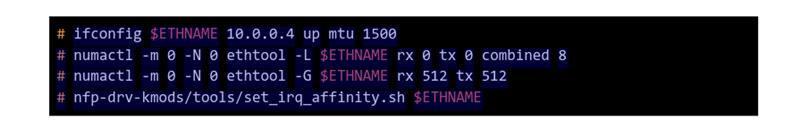

# Project README

This project provides an implentation of PUF protocol using the XDP (eXpress Data Path) technology to process network packets directly on the network interface. The example code uses XDP to implement a simple packet filter that drops all incoming UDP packets.

## Prerequisites

Before you can use this project, you need to make sure that your system meets the following requirements:

- Linux kernel version 4.8 or later.
- The libbpf library.
- The iproute2 package.
- The LLVM compiler toolchain.

Follow the [link](https://github.com/xdp-project/xdp-tutorial/blob/master/setup_dependencies.org) to setup the above dependencies. 

## Installation

To install the code, follow these steps:

1. Clone this repository to your local machine and put anyone of the directory [verifier](https://github.com/networked-systems-iith/PUFAuth/tree/main/XDP/verifi) in the root directory of [xdp-tutorial](https://github.com/xdp-project/xdp-tutorial/tree/master).
2. Change into the project for eg. xdp-puf directory using `cd xdp-puf`.
3. Compile the XDP code by running `make`.

## Setup XDP on Network Interface

To set up XDP on a network interface, follow these steps:

1. Identify the name of the network interface that you want to use. You can use the `ip link show` command to list all available network interfaces.
2. Load the XDP program onto the network interface using the `ip` command. For example, to load the XDP program onto the `eth0` interface, run the following command:

   ```
   sudo ip link set dev eth0 xdp obj xdp_filter.o
   ```

   Replace `xdp_filter.o` with the name of the compiled XDP program that you want to load.

3. Verify that the XDP program is loaded by using the `ip` command:

   ```
   sudo ip link show dev eth0
   ```

   The output should include a line that says `xdp` followed by the name of the loaded XDP program.

## Running the Code

To run the code, follow these steps:

1. Change into the project for eg. xdp-puf directory using `cd xdp-puf`.
2. Run the command `sudo ./xdp_load_and_stats dev ens802np0--force-progsec xdp_prog`.
3. If you get error `Kernel error message: nfp: Insufficient number of TX rings w/ XDP enabled`, resolve this by running below commands:
     


## License

This project is licensed under the MIT License. See the `LICENSE` file for details.
